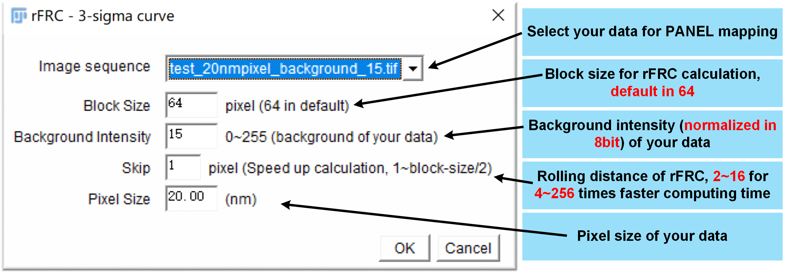
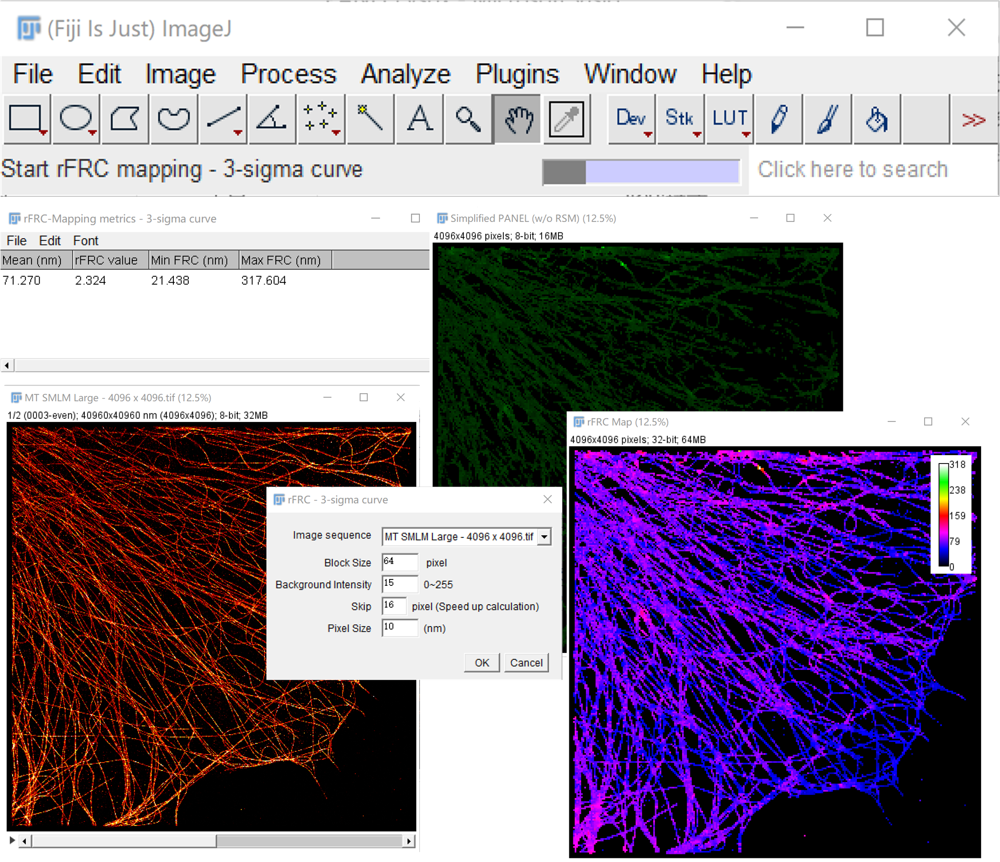
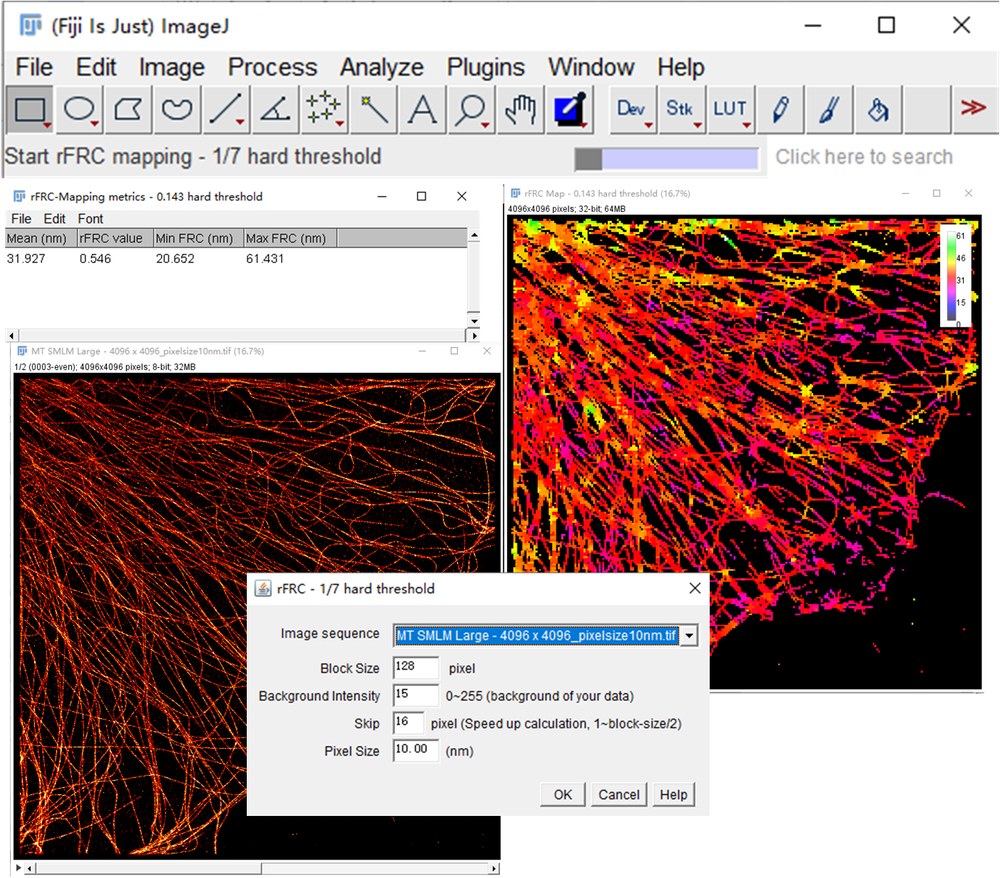

 

 

 
 

<h1 align="center">PANELJ</h1>
<h6 align="right">v0.2.5</h6>
<h5 align="center">rFRC mapping and PANEL pinpointing with with FIJI/ImageJ.</h5>

 

rFRC (rolling Fourier ring correlation) mapping and simplified PANEL (Pixel-level ANalysis of Error Locations) (w/o RSM) pinpointing. This repository will be in continued development. The full PANEL can be found in [PANELM](https://github.com/WeisongZhao/PANELM). If you find this useful, please cite the corresponding publication. [Weisong Zhao et al. Quantitatively mapping local quality of super-resolution microscopy by rolling Fourier ring correlation, Light: Science & Applications (2023)](https://doi.org/10.1038/s41377-023-01321-0). More details on [Wiki](https://github.com/WeisongZhao/PANELJ/wiki/). If it helps your research, please cite our work in your publications. 

 
 
 

 

[Portal](https://github.com/WeisongZhao/PANELJ/raw/main/PANELJ_-0.2.5.jar) to the plugin.

More details on [PANELJ Wiki](https://github.com/WeisongZhao/PANELJ/wiki/) & [PANELM Wiki](https://github.com/WeisongZhao/PANELM/wiki/).

If you are not a imagej user, you can have a try on the Python version: [PANELpy](https://github.com/WeisongZhao/PANELpy), or the MATLAB  version: [PANELM](https://github.com/WeisongZhao/PANELM).

## Usages of rFRC and PANEL in specific

The `rFRC` is for quantitatively mapping the local image quality (effective resolution, data uncertainty). The lower effective resolution gives a higher probability to the error existence, and thus we can use it to represent the uncertainty revealing the error distribution.

**rFRC is capable of:**
- **Data uncertainty mapping** of reconstructions without Ground-Truth (Reconstruction-1 vs Reconstruction-2) | 3σ curve is recommended;
- **Data uncertainty and leaked model uncertainty mapping** of deep-learning predictions of low-level vision tasks without Ground-Truth (Prediction-1 from input-1 vs Prediction-2 from input-2) | 3σ curve is recommended;
- **Model uncertainty mapping** of deep-learning predictions of low-level vision tasks without Ground-Truth (Prediction-1 from model-1 vs Prediction-2 from model-2) | 3σ curve is recommended;
- **Full error mapping** of reconstructions/predictions with Ground-Truth (Reconstruction/Prediction vs Ground-Truth) | 3σ curve is recommended;
- **Resolution mapping** of raw images (Image-1 vs Image-2) | 1/7 hard threshold or 3σ curve are both feasible;

**When two-frame is not accessible, two alternative strategies for single-frame mapping is also provided (not stable, the two-frame version is recommended).** 

**PANEL**

- In this plugin, `PANEL` is a `filtered rFRC` map, for biologists to qualitatively pinpoint regions with low reliability as a concise visualization

- Note that our `rFRC` and `PANEL` using two independent captures cannot fully pinpoint the unreliable regions induced by the model bias, which would require more extensive characterization and correction routines based on the underlying theory of the corresponding models.

## PANELJ for local quality mapping (3-sigma curve)

## PANELJ for for local quality mapping (1/7 hard threshold)
Although the so-called 1/7 threshold has been discussed in our manuscript to be unstable in local resolution mapping, we still provide the resolution mapping feature based on 1/7 threshold. The reason is that the 1/7 threshold is popular and has been used widely. We intend to give an identical local resolution mapping for the users.

## Declaration
This repository contains the java source code (Maven) for <b>rFRC & PANEL</b> imagej plugin. The development of this imagej plugin is work in progress, so expect rough edges. 

If you want to reproduce the results of the publication, the <b>PANELM</b> (Matlab version) is recommended. Due to the distance between the core FRC calculation of <b>PANELJ</b>, and <b>PANELM</b>, and the difference between Fourier transform of Matlab and imagej, there may exist a gap between the results of <b>PANELM</b> and <b>PANELJ</b>. The implementations of core FRC, and Fourier transform in <b>PANELM</b> are more flexible and accurate. 

TO the [PANELM](https://github.com/WeisongZhao/PANELM)

## Version
- v0.2.5 Single-frame rFRC mapping
- v0.1.0 Initial rFRC mapping

## Related links: 
- Python version: [PANELpy](https://github.com/WeisongZhao/PANELpy/)
- MATLAB version: [PANELM](https://github.com/WeisongZhao/PANELM/)
- **Some fancy results and comparisons:** [my website](https://weisongzhao.github.io/MyWeb2/portfolio-4-col.html)
- **Further reading:** [#behind_the_paper](https://communities.springernature.com/posts/a-nice-piece-of-the-puzzle-for-super-resolution-microscopy).
- **Publication:**[Weisong Zhao et al. Quantitatively mapping local quality of super-resolution microscopy by rolling Fourier ring correlation, Light: Science & Applications (2023)](https://doi.org/10.1038/s41377-023-01321-0).
- **Preprint:** [Weisong Zhao et al., Quantitatively mapping local quality of super-resolution microscopy by rolling Fourier ring correlation, bioRxiv (2022)](https://doi.org/10.1101/2022.12.01.518675).

<b>Plans</b>

- Reduce the gap between the core FRC of PANELM and PANELJ;
- ~~The single-frame rFRC mapping~~;
- The RSM combination for full PANEL.

## Open source [PANELJ](https://github.com/WeisongZhao/PANELJ)

- This software and corresponding methods can only be used for **non-commercial** use, and they are under Open Data Commons Open Database License v1.0.
- Feedback, questions, bug reports and patches are welcome and encouraged!