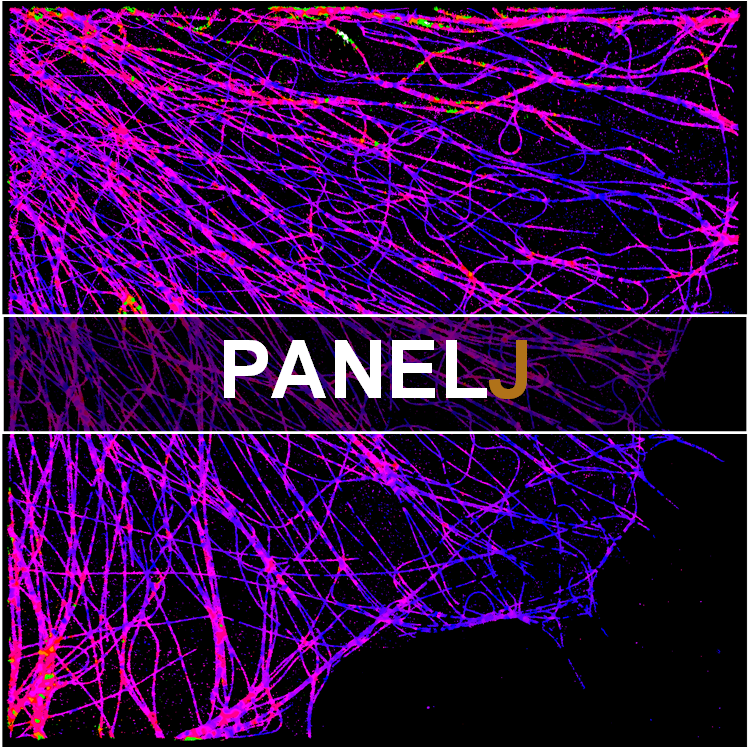

 

 
 

<h1 align="center">PANELJ</h1>
<h6 align="right">v0.2.5</h6>
<h5 align="center">Pixel-level ANalysis of Error Locations (or resolution) with FIJI/ImageJ.</h5>

 

This repository is for Simplified PANEL (w/o RSM) and will be in continued development. The full PANEL can be found in [PANELM](https://github.com/WeisongZhao/PANELM). If you find this useful, please cite the corresponding publication. [Weisong Zhao et al. PANEL: quantitatively mapping reconstruction errors at super-resolution scale by rolling Fourier ring correlation, <!-- Nature Methods -->, X, XXX-XXX (2022)](https://www.nature.com/nmeth/).

 
 
 

 

[Portal](https://github.com/WeisongZhao/PANELJ/blob/main/PANELJ_-0.2.5.jar/) to the plugin.

## Usage of PANEL in specific

**Error types:** There are exiting two major categories of reconstruction errors/artifacts in computational microscopy imaging, including the `model errors` and the `data errors`. The `model errors` are primarily caused by the difference between the artificially created estimation model and its physical, real-world counterpart, which can be detected and minimized by careful calibration of the optical microscopy system or enough training data in learning-based applications. The `data errors` are mostly introduced by joint effects of the noise condition and sampling capability of the hardware equipment. Notably, different from the `model errors`, the `data errors` are free from the model, inevitable, and may be hard to be suppressed by system calibration or adding more training datasets.

**PANEL is capable of:**
- **Data error mapping** of reconstructions without Ground-Truth (Reconstruction-1 vs Reconstruction-2) | 3σ curve is recommended;
- **Data error and leaked model error mapping** of deep-learning predictions of low-level vision tasks without Ground-Truth (Prediction-1 vs Prediction-2) | 3σ curve is recommended;
- **Full error mapping** of reconstructions/predictions with Ground-Truth (Reconstruction/Prediction vs Ground-Truth) | 3σ curve is recommended;
- **Resolution mapping** of raw images (Image-1 vs Image-2) | 1/7 hard threshold or 3σ curve are both feasible;

**When two-frame is not accessible, two alternative strategies for single-frame mapping is also provided (but not stable, the two-frame version is recommended).** 

**WARNING**: The current single-frame error/resolution mapping feature is still an unstable `beta version`.

## PANELJ for error mapping (3-sigma curve)

## PANELJ for resolution mapping (1/7 hard threshold)
Although the so-called 1/7 threshold has been discussed in our manuscript to be unstable in local resolution mapping, we still provide the resolution mapping feature based on 1/7 threshold. The reason is that the 1/7 threshold is popular and has been used widely. We intend to give an identical local resolution mapping for the users.

## Declaration
This repository contains the java source code (Maven) for <b>PANEL</b> imagej plugin.  This plugin is for the <b>Simplified PANEL</b> (w/o RSM), and is also accompanied with resolution mapping (<b>1/7</b> golden threshold) feature. ~~The feature single-frame error/resolution mapping is currently not included in <b>PANELJ</b>~~ . The development of this imagej plugin is work in progress, so expect rough edges. 

If you want to reproduce the results of PANEL publication, the <b>PANELM</b> (Matlab version) is recommended. Due to the distance between the core FRC calculation of <b>PANELJ</b>, and <b>PANELM</b>, and the difference between Fourier transform of Matlab and imagej, there may exist a gap between the results of <b>PANELM</b> and <b>PANELJ</b>. The implementations of core FRC, and Fourier transform in <b>PANELM</b> are more flexible and accurate. 

TO the [PANELM](https://github.com/WeisongZhao/PANELM)

Here is an example dataset [LDSMLM_20nmpixel_background_15.tif](https://github.com/WeisongZhao/PANELJ/releases/download/v0.2.5/LDSMLM_20nmpixel_background_15.tif).

## Version
- v0.2.5 Single-frame rFRC mapping
- v0.1.0 Initial rFRC mapping

<b>Plans</b>

- Reduce the gap between the core FRC of PANELM and PANELJ;
- ~~The single-frame FRC error/resolution mapping~~;
- The RSM combination for full PANEL.

## Open source [PANELJ](https://github.com/WeisongZhao/PANELJ)

- This software and corresponding methods can only be used for **non-commercial** use, and they are under Open Data Commons Open Database License v1.0.
- Feedback, questions, bug reports and patches are welcome and encouraged!